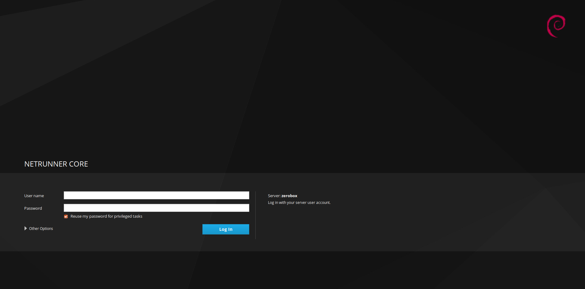
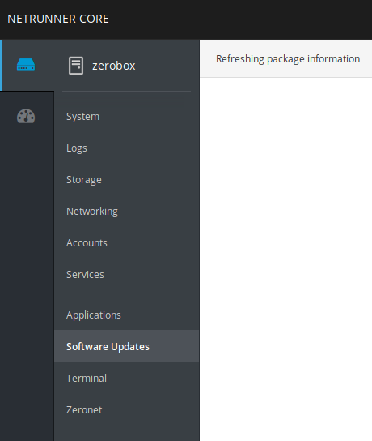
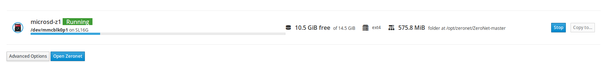

# Prerequisite

This section explain what to do right after plugged in your zerobox.

## Setup a safe browser on your device

On Your computer, tablet or phone, we recommend to install [Firefox browser](https://www.mozilla.org/en-US/firefox/) to browse ZeroNet with.

## Access Cockpit

Cockpit allow you to manage ZeroNet from your device using its web interface. You can find it at [zerobox:9090](http://zerobox:9090)

### Log In

Enter the username choosen during the installation and the appropriate password. You also need to tick "Reuse my password for privileged tasks" for update.

### Update

You can update the Zerobox with the latest package from this section.

### Zeronet Section

The Zeronet section gives you control over the Zeronet program.

#### Overview

The Zeronet section shows :
 * free space is available on the box
 * data being used by Zeronet (e.g 575.8 MiB)
 * Zeronet folder (e.g /opt/zeronet/ZeroNet-master)
 * current status

#### Start and Stop Zeronet

From

#### Copy Zeronet

#### Start from external device
